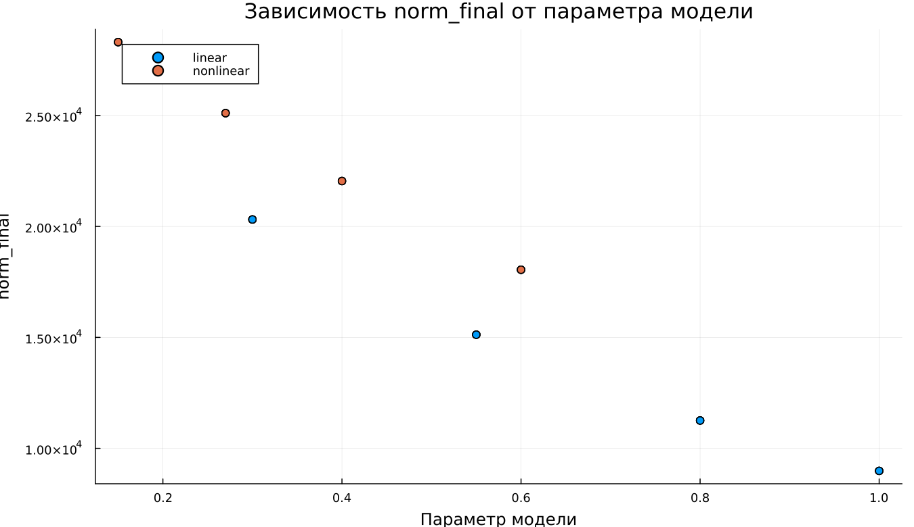

---
## Author
author:
  name: Максим Новичков
  email: 1132232888@rudn.ru
  affiliation:
    - name: Российский университет дружбы народов
      country: Российская Федерация
      postal-code: 117198
      city: Москва
      address: ул. Миклухо-Маклая, д. 6

## Title
title: "Математическое моделирование"
subtitle: "Лабораторная работа № 3"
license: "CC BY"
date: today
date-format: "YYYY-MM-DD"
---

# Вводная часть

## Цель работы

Изучить модели Ланчестера и проанализировать, как меняется численность войск при различных вариантах вооружённого противостояния.

## Задание

1. Рассмотреть три типа моделей Ланчестера.
2. Построить графики изменения численности войск.
3. Проанализировать динамику решений и определить победившую сторону.

# Теория: модели боевых действий

## Общая идея моделей Ланчестера

В конфликте участвуют две стороны, численности которых задаются функциями

$$
x(t), \quad y(t)
$$

Если в некоторый момент одна из функций становится равной нулю, соответствующая сторона считается проигравшей.

## Случай 1: регулярные войска против регулярных войск

Математическая модель имеет вид:

$$
\begin{cases}
\frac{dx}{dt}= -a(t)x(t) - b(t)y(t) + P(t) \\
\frac{dy}{dt}= -c(t)x(t) - h(t)y(t) + Q(t)
\end{cases}
$$

В этой модели учитываются:

- потери, не связанные с боевыми действиями;
- потери в результате столкновения сторон;
- поступление подкрепления.

## Случай 2: регулярные войска против партизан

Здесь потери партизанских формирований определяются как численностью регулярной армии, так и их собственной численностью:

$$
\begin{cases}
\frac{dx}{dt}= -a(t)x(t) - b(t)y(t) + P(t) \\
\frac{dy}{dt}= -c(t)x(t)y(t) - h(t)y(t) + Q(t)
\end{cases}
$$

## Случай 3: партизаны против партизан

В случае противостояния двух нерегулярных формирований система записывается так:

$$
\begin{cases}
\frac{dx}{dt}= -a(t)x(t) - b(t)x(t)y(t) + P(t) \\
\frac{dy}{dt}= -h(t)y(t) - c(t)x(t)y(t) + Q(t)
\end{cases}
$$

# Упрощённые модели

## Жесткая модель для регулярных армий

Если пренебречь подкреплением и небоевыми потерями, получаем систему

$$
\begin{cases}
\frac{dx}{dt}= -by \\
\frac{dy}{dt}= -ax
\end{cases}
$$

Для этой модели возможно точное аналитическое решение, а фазовые траектории представляют собой гиперболы.

## Качественный вывод

Исход противостояния определяется не только начальной численностью сторон, но и эффективностью их вооружения.

Основные выводы:

- численное превосходство даёт существенное преимущество;
- для компенсации такого превосходства требуется значительно более высокая боевая эффективность.

# Постановка задачи

## Исходные данные

Между страной $X$ и страной $Y$ рассматривается военный конфликт.

Начальные численности армий заданы условиями

$$
x(0)=32888, \qquad y(0)=17777
$$

Необходимо построить графики изменения численности войск для двух моделей.

## Случай 1: линейная модель

$$
\begin{cases}
\frac{dx}{dt}= -0.55x(t) - 0.77y(t) + 1.5\sin(3t+1) \\
\frac{dy}{dt}= -0.66x(t) - 0.44y(t) + 1.2\cos(t+1)
\end{cases}
$$

## Случай 2: нелинейная модель

$$
\begin{cases}
\frac{dx}{dt}= -0.27x(t) - 0.88y(t) + \sin(20t) \\
\frac{dy}{dt}= -0.68x(t)y(t) - 0.37y(t) + \cos(10t)
\end{cases}
$$

# Эксперимент: базовые расчёты

## Базовый эксперимент: линейная модель

## Базовый эксперимент: линейная модель

Наблюдаемые особенности:

- обе переменные убывают со временем;
- функция $x(t)$ снижается плавно;
- функция $y(t)$ уменьшается быстрее и почти достигает нуля к концу интервала;
- поведение системы остаётся устойчивым и предсказуемым.

## Базовый эксперимент: нелинейная модель

## Базовый эксперимент: нелинейная модель

Основные наблюдения:

- функция $x(t)$ убывает медленнее, чем в линейной модели;
- функция $y(t)$ практически сразу стремится к нулю;
- после этого динамика системы в основном определяется переменной $x(t)$;
- нелинейные члены существенно ускоряют затухание.

# Параметрический анализ

## Сканирование траекторий $x(t)$

## Сканирование траекторий $x(t)$

В ходе исследования изменялся один из параметров модели.

Результаты показывают:

- с ростом параметра скорость убывания $x(t)$ увеличивается;
- траектории становятся более крутыми;
- различия особенно хорошо заметны в середине и в конце интервала интегрирования.

## Сканирование траекторий $y(t)$

## Сканирование траекторий $y(t)$

По графикам можно сделать следующие выводы:

- в линейной модели увеличение параметра ускоряет уменьшение $y(t)$;
- в нелинейной модели $y(t)$ быстро обращается в нуль почти при любом значении параметра;
- влияние нелинейных членов оказывается определяющим.

# Анализ вычислительных затрат

## Время вычислений

## Время вычислений

Полученные результаты показывают:

- линейная модель рассчитывается быстрее;
- время вычисления линейной системы имеет порядок $10^{-5}$ сек;
- для нелинейной модели время составляет порядка $10^{-4}$–$10^{-3}$ сек;
- даже при этом вычислительные затраты остаются небольшими.

# Анализ итоговой метрики

## Метрика norm_final

В качестве итоговой характеристики использовалась величина

$$
\text{norm\_final}=\sqrt{x(t_{final})^2 + y(t_{final})^2}
$$

Она отражает величину состояния системы в финальный момент моделирования.

## Зависимость norm_final от параметра

## Интерпретация результата

Анализ графика показывает:

- при увеличении параметра значение метрики уменьшается;
- линейная модель быстрее приближается к состоянию покоя;
- нелинейная модель дольше сохраняет заметную величину состояния;
- это связано с более медленным затуханием переменной $x(t)$.

# Итоги

## Выводы

1. Линейная модель демонстрирует плавное и устойчивое уменьшение обеих переменных.
2. В нелинейной модели переменная $y(t)$ практически мгновенно стремится к нулю.
3. Параметры заметно влияют на скорость затухания решений.
4. В линейной модели это влияние проявляется более отчётливо.
5. Нелинейная система требует больших вычислительных затрат, однако остаётся очень дешёвой с точки зрения времени расчёта.
6. Уменьшение метрики $\text{norm\_final}$ при росте параметра подтверждает усиление затухания динамики.

# Список литературы

1. Законы Осипова — Ланчестера.
2. Дифференциальные уравнения динамики боя.
3. Элементарные модели боя.
