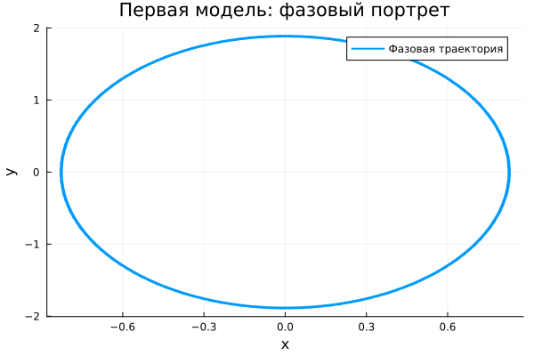

---
## Author
author:
  name: Максим Новичков
  email: 1132232888@rudn.ru
  affiliation:
    - name: Российский университет дружбы народов
      country: Российская Федерация
      postal-code: 117198
      city: Москва
      address: ул. Миклухо-Маклая, д. 6

## Title
title: "Математическое моделирование"
subtitle: "Лабораторная работа № 4"
license: "CC BY"
---

# Цель работы

Исследовать математическую модель гармонического осциллятора и проанализировать её поведение при различных условиях.

# Задание

1. Получить решение уравнения гармонического осциллятора без учёта затухания.  
2. Сформулировать уравнение затухающего осциллятора, найти его решение и построить фазовый портрет.  
3. Рассмотреть случай воздействия внешней силы, найти решение и построить соответствующий фазовый портрет.

# Выполнение лабораторной работы

## Теоретические сведения

Многие процессы, возникающие в механике, электротехнике, химии и биологии, могут быть описаны единой моделью — линейным гармоническим осциллятором. Она базируется на дифференциальном уравнении второго порядка.

Общее уравнение свободных колебаний имеет вид:
$$
\ddot{x} + 2\gamma \dot{x} + \omega_0^2 x = 0
$$

Здесь $x$ характеризует состояние системы (например, смещение или заряд), $\gamma$ отражает потери энергии, а $\omega_0$ задаёт собственную частоту.

При отсутствии потерь ($\gamma = 0$) система становится консервативной:
$$
\ddot{x} + \omega_0^2 x = 0
$$

Для однозначного решения необходимо задать начальные условия:
$$
\begin{cases}
x(t_0) = x_0 \\
\dot{x}(t_0) = y_0
\end{cases}
$$

Переход к системе первого порядка:
$$
\begin{cases}
\dot{x} = y \\
\dot{y} = -\omega_0^2 x
\end{cases}
$$

Начальные условия:
$$
\begin{cases}
x(t_0) = x_0 \\
y(t_0) = y_0
\end{cases}
$$

Переменные $x$ и $y$ образуют фазовое пространство. Каждому решению соответствует траектория на фазовой плоскости, а совокупность таких траекторий формирует фазовый портрет системы.

## Задача

Построить решения и фазовые портреты для следующих моделей:

1. Без затухания и внешнего воздействия:
$$
\ddot{x} + 5.2x = 0
$$

2. С затуханием:
$$
\ddot{x} + 14\dot{x} + 0.5x = 0
$$

3. С затуханием и внешней силой:
$$
\ddot{x} + 13\dot{x} + 0.3x = 0.8\sin(9t)
$$

Интервал моделирования:
$$
t \in [0; 59], \quad h = 0.05, \quad x_0 = 0.5, \quad y_0 = -1.5
$$

### Преобразование моделей

1. Без затухания:
$$
\begin{cases}
\dot{x} = y \\
\dot{y} = -\omega_0^2 x
\end{cases}
$$

2. С затуханием:
$$
\begin{cases}
\dot{x} = y \\
\dot{y} = -2\gamma y - \omega_0^2 x
\end{cases}
$$

3. С внешней силой:
$$
\begin{cases}
\dot{x} = y \\
\dot{y} = F(t) - 2\gamma y - \omega_0^2 x
\end{cases}
$$

Для численного моделирования использовались внешние программные модули:





## Базовые эксперименты

### Первая модель (model_type = model1)

График $y(t)$ демонстрирует устойчивые периодические колебания с практически неизменной амплитудой. Кривая имеет регулярный повторяющийся характер.

Такое поведение указывает на отсутствие потерь энергии. Система сохраняет энергию, поэтому движение не затухает.

Фазовый портрет представляет собой замкнутую траекторию, что свидетельствует о периодичности движения.

Следовательно, модель описывает идеальные колебания без диссипации.

### Вторая модель (model_type = model2)

На графике $y(t)$ наблюдается быстрое уменьшение амплитуды. После начального этапа система выходит в состояние покоя.

Причина — наличие демпфирующего члена, вызывающего рассеяние энергии.

Фазовая траектория стремится к точке равновесия, что подтверждает затухающий характер движения.

Таким образом, система демонстрирует апериодическое затухание.

### Третья модель (model_type = model3)

После переходного процесса система выходит на режим устойчивых колебаний с небольшой амплитудой.

Затухание подавляет собственные колебания, однако внешняя сила поддерживает движение.

Фазовый портрет показывает компактную замкнутую область, соответствующую установившемуся режиму.

Таким образом, реализуется режим вынужденных колебаний.

## Параметрическое сканирование

### Траектории $x(t)$

Изменение параметров приводит к следующим эффектам:

- в первой модели изменяется частота;
- во второй — скорость затухания;
- в третьей — характеристики вынужденных колебаний.

Общие выводы:

- первая система сохраняет колебания;
- вторая стремится к равновесию;
- третья выходит на стационарный режим.

### Траектории $y(t)$

Анализ подтверждает:

- устойчивые колебания в первой модели;
- быстрое затухание во второй;
- наличие вынужденных колебаний в третьей.

## Время вычислений

Результаты показывают:

- минимальное время у первой модели;
- немного большее — у второй;
- наибольшее — у третьей.

Тем не менее, во всех случаях вычисления выполняются быстро.

## Анализ метрики norm_final

Рассматриваемая величина:
$$
\text{norm\_final} = \sqrt{x(t_{final})^2 + y(t_{final})^2}
$$

Наблюдения:

- первая модель — значение остаётся значительным;
- вторая — стремится к нулю;
- третья — принимает малые значения, отличные от нуля.

# Выводы

1. Первая система реализует незатухающие колебания.  
2. Вторая быстро достигает равновесия.  
3. Третья формирует устойчивые вынужденные колебания.  
4. Параметры существенно влияют на динамику системы.  
5. Все модели эффективно решаются численно.  
6. Метрика $\text{norm\_final}$ отражает различия в поведении систем.

# Список литературы {.unnumbered}

1. [Гармонический осциллятор](https://ru.wikipedia.org/wiki/Гармонический_осциллятор)  
2. [Моделирование колебательных систем](https://www.numamo.org/HTML/Articles/Oscillator.html)  
