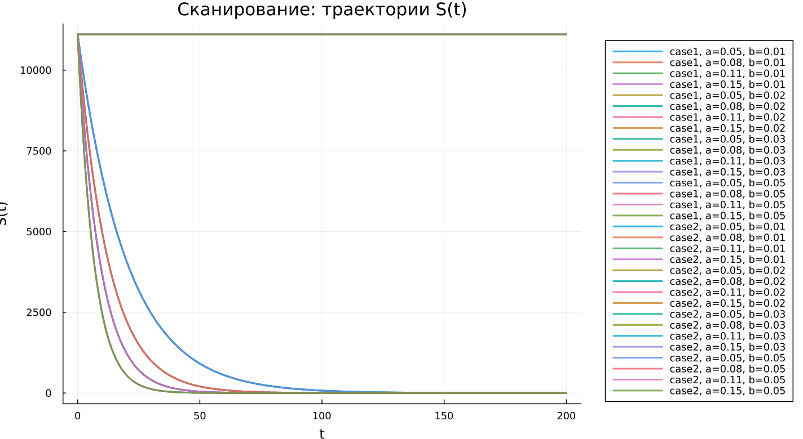
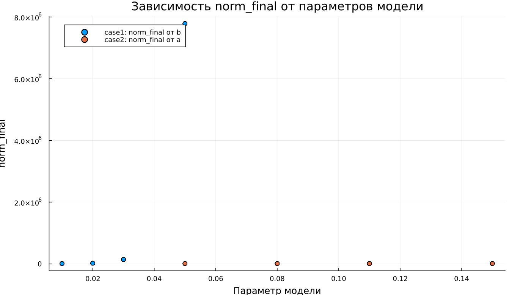

---
author:
  name: Максим Новичков
  email: 1132232888@rudn.ru
  affiliation:
    - name: Российский университет дружбы народов
      country: Российская Федерация
      city: Москва
title: "Математическое моделирование"
subtitle: "Лабораторная работа № 6"
license: "CC BY"
date: today
date-format: "YYYY-MM-DD"
---

# Вводная часть

## Цель работы

Рассмотреть эпидемиологическую модель $SIR$ и исследовать характер изменения численности групп населения при распространении заболевания.

## Задание

1. Изучить модель эпидемии.
2. Построить графики изменения функций $S(t)$, $I(t)$ и $R(t)$.
3. Проанализировать два режима:
   - $I(0) \leq I^*$;
   - $I(0) > I^*$.
4. Провести параметрическое исследование.
5. Сравнить полученные модели и сделать выводы.

# Теоретические сведения

## Модель SIR

В модели $SIR$ вся популяция разделяется на три основные группы:

- $S(t)$ — особи, восприимчивые к заболеванию;
- $I(t)$ — инфицированные особи;
- $R(t)$ — выздоровевшие особи, имеющие иммунитет.

Суммарная численность популяции задаётся выражением:

$$
N = S(t) + I(t) + R(t).
$$

## Смысл модели

Модель описывает последовательный переход особей между группами:

$$
S \rightarrow I \rightarrow R.
$$

Сначала восприимчивые особи заражаются и переходят в группу инфицированных. Затем инфицированные выздоравливают и переходят в группу $R$.

## Условие изоляции

В модели учитывается критический уровень числа заболевших $I^*$. Пока количество инфицированных не превышает этот порог, считается, что заболевшие изолированы и не заражают восприимчивых.

Если выполняется условие:

$$
I(t) \leq I^*,
$$

то новых заражений не происходит.

Если же:

$$
I(t) > I^*,
$$

то инфицированные начинают распространять заболевание среди восприимчивых особей.

## Уравнение для $S(t)$

Изменение числа восприимчивых особей описывается уравнением:

$$
\frac{dS}{dt} =
\begin{cases}
-\alpha S, & I(t) > I^*, \\
0, & I(t) \leq I^*.
\end{cases}
$$

## Уравнение для $I(t)$

Динамика числа инфицированных определяется следующим соотношением:

$$
\frac{dI}{dt} =
\begin{cases}
\alpha S - \beta I, & I(t) > I^*, \\
-\beta I, & I(t) \leq I^*.
\end{cases}
$$

## Уравнение для $R(t)$

Число выздоровевших изменяется по закону:

$$
\frac{dR}{dt} = \beta I.
$$

Параметры модели имеют следующий смысл:

- $\alpha$ — коэффициент интенсивности заражения;
- $\beta$ — коэффициент выздоровления.

# Постановка задачи

## Исходные данные

Рассматривается остров, на котором началась эпидемия.

Известно:

$$
N = 11400,
$$

$$
I(0) = 250,
$$

$$
R(0) = 47.
$$

## Начальное число восприимчивых

Количество восприимчивых к заболеванию людей в начальный момент времени определяется формулой:

$$
S(0) = N - I(0) - R(0).
$$

После подстановки исходных данных получаем:

$$
S(0) = 11400 - 250 - 47 = 11103.
$$

## Рассматриваемые случаи

В работе анализируются два варианта развития системы:

1. $I(0) \leq I^*$ — начальное число инфицированных не превышает критическое значение.
2. $I(0) > I^*$ — начальное число инфицированных больше критического значения.

# Базовые эксперименты

## Первая модель: временные зависимости

## Первая модель: фазовый портрет

## Анализ первой модели

В первой модели наблюдается поведение, которое отличается от классического эпидемиологического процесса:

- $S(t)$ не изменяется во времени;
- $I(t)$ растёт по экспоненциальному закону;
- $R(t)$ уменьшается и может принимать отрицательные значения;
- в системе отсутствует механизм, ограничивающий рост инфицированных.

## Вывод по первой модели

Первая модель нарушает физический смысл $SIR$-системы.

Основная особенность заключается в том, что:

$$
S(t) = const.
$$

Из-за этого число восприимчивых не сокращается, а количество инфицированных продолжает увеличиваться без стабилизации.

# Вторая модель

## Вторая модель: временные зависимости

## Вторая модель: фазовый портрет

## Анализ второй модели

Во второй модели получается более естественная динамика эпидемии:

- $S(t)$ постепенно уменьшается;
- $I(t)$ сначала возрастает;
- затем $I(t)$ достигает максимального значения;
- после пика число инфицированных снижается;
- $R(t)$ монотонно увеличивается.

## Интерпретация второй модели

На начальном этапе инфекция активно распространяется среди восприимчивых особей.

Далее число восприимчивых уменьшается, поэтому скорость заражения падает. В результате эпидемия постепенно затухает:

$$
I(t) \rightarrow 0.
$$

# Сравнение базовых моделей

## Качественное различие

| Характеристика | Первая модель | Вторая модель |
|---|---|---|
| $S(t)$ | остаётся постоянным | уменьшается |
| $I(t)$ | растёт без ограничения | имеет конечный максимум |
| $R(t)$ | может становиться отрицательным | монотонно возрастает |
| Фазовый портрет | вертикальная траектория | незамкнутая кривая |
| Физический смысл | нарушается | сохраняется |

# Параметрическое исследование

## Сканирование траекторий $S(t)$

## Анализ траекторий $S(t)$

Для первой модели:

- значение $S(t)$ остаётся неизменным;
- изменение параметров практически не отражается на группе восприимчивых.

Для второй модели:

- $S(t)$ убывает с течением времени;
- увеличение параметра $a$ ускоряет сокращение числа восприимчивых.

## Сканирование траекторий $I(t)$

## Анализ траекторий $I(t)$

Первая модель:

- показывает экспоненциальное увеличение $I(t)$;
- при росте параметра $b$ скорость увеличения инфицированных возрастает.

Вторая модель:

- формирует типичную эпидемическую волну;
- $I(t)$ сначала растёт, затем достигает пика и уменьшается.

## Сканирование траекторий $R(t)$

## Анализ траекторий $R(t)$

Первая модель:

- приводит к некорректному поведению $R(t)$;
- возможен уход значений в отрицательную область.

Вторая модель:

- демонстрирует постепенное накопление выздоровевших;
- $R(t)$ стремится к некоторому конечному значению.

## Фазовые траектории

## Анализ фазовых траекторий

Фазовые портреты наглядно показывают различие между моделями:

- в первой модели траектории становятся вертикальными линиями;
- во второй модели траектории имеют характерную форму для $SIR$-процесса;
- сначала $I$ увеличивается при уменьшении $S$;
- затем число инфицированных начинает снижаться.

# Анализ итоговых метрик

## Метрика norm_final

В качестве итоговой характеристики использовалась метрика:

$$
\text{norm\_final} =
\sqrt{
S(t_{final})^2 +
I(t_{final})^2 +
R(t_{final})^2
}.
$$

Она позволяет оценить состояние системы в конце численного моделирования.

## Зависимость norm_final от параметра

## Интерпретация norm_final

Для первой модели:

- значение метрики быстро увеличивается;
- основной причиной является экспоненциальный рост $I(t)$.

Для второй модели:

- значения метрики оказываются меньше;
- система стремится к устойчивому конечному состоянию.

# Максимум инфицированных

## Зависимость $I_{max}$ от параметра

## Анализ $I_{max}$

Первая модель:

- даёт очень большие значения $I_{max}$;
- рост числа инфицированных ничем не ограничивается.

Вторая модель:

- имеет конечный максимум инфицированных;
- величина пика зависит от параметра $a$;
- при увеличении $a$ максимум достигается быстрее.

# Анализ вычислений

## Время вычислений

## Интерпретация времени вычислений

Проведённый бенчмаркинг показал:

- обе модели численно решаются достаточно быстро;
- время вычислений имеет порядок $10^{-4}$ секунды;
- изменение параметров почти не увеличивает вычислительную сложность;
- используемый численный метод работает эффективно.

# Итоги

## Основные результаты

1. Первая модель показывает нефизичное поведение системы.
2. В первой модели число инфицированных возрастает без ограничения.
3. Вторая модель воспроизводит реалистичную эпидемическую волну.
4. Во второй модели эпидемия постепенно затухает, а $I(t) \to 0$.
5. Фазовые портреты подтверждают качественное различие между двумя случаями.

## Выводы

1. Модель case1 нельзя считать корректной моделью эпидемии, поскольку она приводит к неограниченному росту числа инфицированных.
2. Модель case2 соответствует логике классического $SIR$-процесса.
3. Параметры $a$ и $b$ влияют на скорость распространения заболевания и форму траекторий.
4. Метрики $\text{norm\_final}$ и $I_{max}$ позволяют количественно сравнить поведение моделей.
5. Численное решение обеих систем выполняется эффективно и не требует значительных вычислительных затрат.

# Список литературы {.unnumbered}

1. [Конструирование эпидемиологических моделей](https://habr.com/ru/post/551682/)
2. [Зараза, гостья наша](https://nplus1.ru/material/2019/12/26/epidemic-math)
